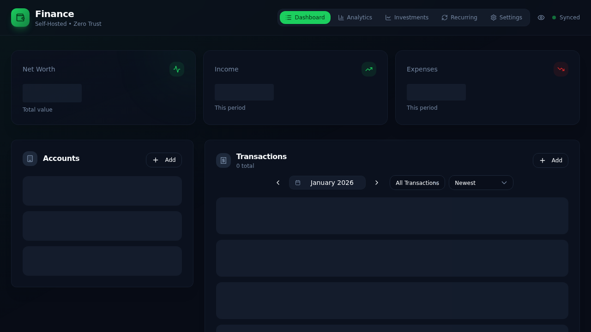
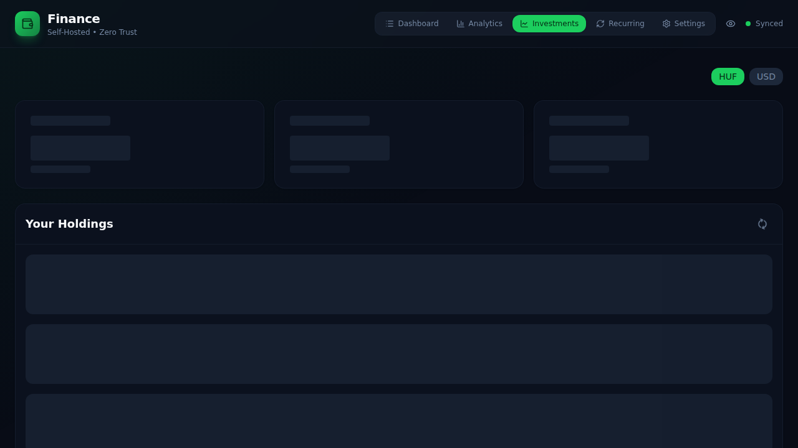
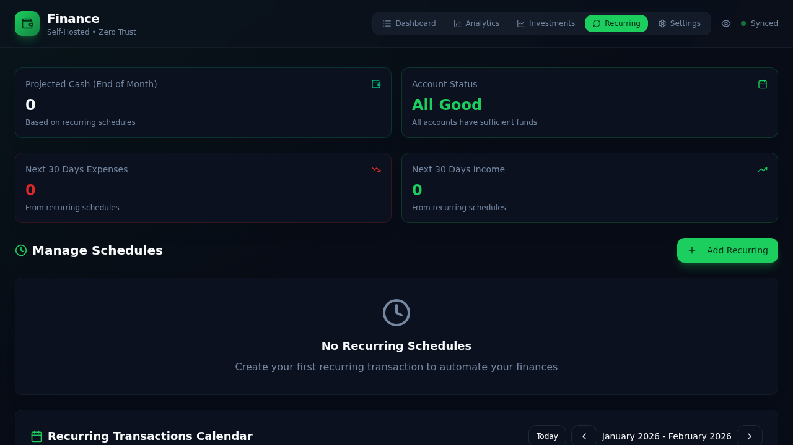

# 💰 Finance Manager

> A full-stack personal finance tracker with multi-currency support, investment portfolio monitoring, recurring transactions automation, and real-time market data integration.



## Table of Contents

- [Overview](#overview)
- [Screenshots](#screenshots)
- [Quick Start](#quick-start)
  - [Backend Deployment](#backend-deployment)
  - [Frontend Deployment](#frontend-deployment)
  - [Automated Deployment](#automated-deployment)
- [Architecture](#architecture)
  - [Tech Stack](#tech-stack)
  - [Project Structure](#project-structure)
- [Core Features](#core-features)
- [How It Works](#how-it-works)
  - [Account System](#account-system)
  - [Transaction Flow](#transaction-flow)
  - [Investment Tracking](#investment-tracking)
  - [Privacy Mode](#privacy-mode)
  - [Recurring Transactions](#recurring-transactions)
  - [Split Transactions](#split-transactions)
  - [Balance Adjustments](#balance-adjustments)
- [Security](#security)
- [Development](#development)
  - [Prerequisites](#prerequisites)
  - [Local Setup](#local-setup)
  - [Environment Variables](#environment-variables)
- [API Documentation](#api-documentation)

---

## Overview

Finance Manager is a modern, privacy-focused personal finance application that helps you track your net worth, manage multiple accounts, monitor investments, automate recurring transactions, and analyze spending patterns. Built on Cloudflare's edge network for global performance and security.

## Screenshots

### Dashboard View

*Main dashboard showing accounts, transactions, and financial overview*

### Analytics View

*Detailed analytics with charts and insights*

### Investments View

*Portfolio tracking with real-time market data*

### Recurring Transactions View

*Automated recurring transaction management with calendar view*

---

## Quick Start

### Backend Deployment

```bash
cd api
npx wrangler d1 execute finance-db --remote --file=schema.sql
npm run deploy
```

### Frontend Deployment

```bash
cd client
npm run build
npx wrangler pages deploy dist --project-name=finance-client
```

### Automated Deployment

Use the deployment script to deploy everything at once:

```bash
./deploy.sh finance-client
```

This script handles:
1. **Database schema updates** — Applies migrations to your D1 database
2. **API deployment** — Deploys backend to Cloudflare Workers
3. **Client build & deploy** — Builds React app and deploys to Cloudflare Pages

---

## Architecture

Finance Manager follows **clean architecture principles** with clear separation of concerns:

- **Backend**: Layered architecture with controllers, services, repositories, DTOs, and mappers
- **Frontend**: Component-based React architecture with context for global state
- **Database**: Edge-deployed SQLite (Cloudflare D1) for low-latency data access
- **Deployment**: Fully automated via deployment script

For detailed architecture documentation, see [API/ARCHITECTURE.md](api/ARCHITECTURE.md).

### Tech Stack

**Backend**
- **Runtime**: Cloudflare Workers (serverless, edge-deployed)
- **Framework**: Hono ^4.0 (lightweight web framework)
- **Database**: Cloudflare D1 (SQLite at the edge)
- **Market Data**: Yahoo Finance API (yahoo-finance2 ^3.10)
- **Architecture**: Clean architecture with controllers, services, repositories, DTOs, and mappers

**Frontend**
- **Framework**: React ^19.2 with TypeScript
- **Build Tool**: Vite ^7.2
- **Styling**: Tailwind CSS ^4.1 with custom design system
- **Charts**: Recharts ^3.5 for data visualization
- **Icons**: Lucide React ^0.554
- **State**: React Context API (Privacy, Alerts, Locked Accounts)
- **PWA**: Progressive Web App with offline support and service workers
- **Date Handling**: date-fns ^2.30 for date formatting and manipulation
- **UI Utilities**: clsx ^2.1, tailwind-merge ^3.4

### Project Structure

```
finance/
├── api/                      # Backend (Cloudflare Workers)
│   ├── src/
│   │   ├── config/          # Application configuration
│   │   ├── controllers/     # HTTP request handlers
│   │   │   ├── account.controller.ts
│   │   │   ├── category.controller.ts
│   │   │   ├── dashboard.controller.ts
│   │   │   ├── investment-transaction.controller.ts
│   │   │   ├── market-data.controller.ts
│   │   │   ├── recurring-schedule.controller.ts
│   │   │   ├── transaction.controller.ts
│   │   │   └── transfer.controller.ts
│   │   ├── dtos/           # Data Transfer Objects
│   │   ├── mappers/        # Entity-DTO mapping
│   │   ├── middlewares/    # CORS & authentication
│   │   ├── models/         # Domain entities
│   │   ├── repositories/   # Database access layer
│   │   ├── routes/         # Route definitions
│   │   ├── services/       # Business logic layer
│   │   ├── types/          # TypeScript types
│   │   ├── utils/          # Utility functions
│   │   └── index.ts        # Application entry point
│   ├── schema.sql          # Database schema
│   ├── wrangler.toml       # Cloudflare Workers config
│   ├── ARCHITECTURE.md     # Detailed architecture docs
│   └── package.json
│
├── client/                   # Frontend (React + Vite)
│   ├── src/
│   │   ├── components/      # React components
│   │   │   ├── AccountList.tsx
│   │   │   ├── TransactionList.tsx
│   │   │   ├── Investments.tsx
│   │   │   ├── InvestmentChart.tsx
│   │   │   ├── Analytics.tsx
│   │   │   ├── DateRangePicker.tsx
│   │   │   ├── TransferForm.tsx
│   │   │   ├── RecurringTransactions.tsx
│   │   │   ├── Settings.tsx
│   │   │   ├── AdjustmentChoiceModal.tsx
│   │   │   ├── SplitTransactionModal.tsx
│   │   │   └── ui/          # Reusable UI components
│   │   │       ├── button.tsx
│   │   │       ├── card.tsx
│   │   │       ├── input.tsx
│   │   │       ├── label.tsx
│   │   │       ├── modal.tsx
│   │   │       └── select.tsx
│   │   ├── context/
│   │   │   ├── PrivacyContext.tsx
│   │   │   ├── AlertContext.tsx
│   │   │   └── LockedAccountsContext.tsx
│   │   ├── lib/
│   │   │   └── utils.ts     # Helper functions
│   │   ├── App.tsx          # Main application
│   │   ├── config.ts        # API configuration
│   │   └── main.tsx         # Entry point
│   ├── public/              # Static assets
│   │   ├── icon-192.png     # PWA icon (192x192)
│   │   ├── icon-512.png     # PWA icon (512x512)
│   │   └── favicon.svg      # Favicon
│   ├── vite.config.ts       # Vite & PWA configuration
│   └── package.json
│
├── screenshots/              # Application screenshots
├── deploy.sh                 # Automated deployment script
└── package.json             # Workspace root
```

---

## Core Features

✨ **Multi-Account Management**
- Cash accounts (checking, savings, wallet)
- Investment accounts (stocks, crypto, manual assets)
- Multi-currency support with real-time conversion
- Account locking (prevent accidental modifications)
- Account exclusion options (exclude from net worth or cash balance calculations)

📊 **Transaction Tracking**
- Categorized income & expenses
- Recurring transactions with automated scheduling
- Linked transfers between accounts
- Custom categories with emoji icons
- **Split transactions** - divide a single transaction across multiple categories
- **Balance adjustments** - reconcile account balances with single or split transactions
- Transaction filtering by type, category, and date range
- Monthly transaction views with pagination

📈 **Investment Portfolio**
- Real-time stock/crypto prices via Yahoo Finance
- Portfolio value tracking with multi-currency support
- Transaction history (buy/sell)
- Performance charts and analytics
- Auto-refresh prices (every 5 minutes)
- Manual asset tracking without market data

🔒 **Privacy & Security**
- Privacy mode to hide sensitive financial data
- Persistent user preference (localStorage + cookie)
- Quick eye icon toggle in header
- Account locking to prevent accidental changes
- Alert system for user notifications
- Three-layer security model (Cloudflare Access, API Key, CORS)

📉 **Analytics Dashboard**
- Net worth overview with real-time calculation
- Income vs. expenses tracking
- Category breakdown charts
- Monthly trends and patterns
- Date range filtering for custom periods
- Period selection (7 days, 30 days, 90 days, year, all time, custom)
- Cash flow visualization


🔄 **Recurring Transactions**
- Automated recurring transaction management
- Daily, weekly, and monthly schedules
- Projected cash flow (end of month)
- Next 30 days income/expense forecasting
- Account status monitoring (sufficient funds alerts)
- Interactive calendar view of upcoming transactions
- Cloudflare Cron Triggers for automated processing


⚙️ **Settings & Customization**
- Master currency selection (HUF, EUR, USD, GBP, CHF, PLN, CZK, RON)
- Category management with custom icons (150+ emoji options)
- Privacy mode toggle
- Cache management and force reload
- Data export (CSV and JSON formats)
- PWA cache control

🌍 **Global Deployment**
- Edge-deployed on Cloudflare network
- Sub-50ms response times worldwide
- Automatic HTTPS and DDoS protection

📱 **Progressive Web App (PWA)**
- Install on mobile devices and desktop
- Offline support with service workers
- Auto-updates and caching
- Native app-like experience
- Custom app icons and splash screens

---

## How It Works

### Account System

The application supports two types of accounts:

1. **Cash Accounts** — Traditional bank accounts, wallets
   - Direct balance management
   - Currency-specific

2. **Investment Accounts** — Asset holdings
   - **Stock/Crypto**: Auto-updates price from Yahoo Finance
   - **Manual**: User-defined assets without market data
   - Balance calculated from: `transactions × current_price`

### Transaction Flow

Every financial action is recorded as a transaction:

```
User Action → Transaction Record → Account Balance Update
```

**Example: Transfer $100 from Checking to Savings**
1. Creates 2 linked transactions:
   - Transaction A: Checking -$100 (expense)
   - Transaction B: Savings +$100 (income)
2. Both transactions share a `linked_transaction_id`
3. Account balances update atomically

**Investment Transactions** are tracked via regular transactions with a `price` field:
- Buy: Negative amount, increases holdings
- Sell: Positive amount, decreases holdings

### Investment Tracking

Investment accounts use a **transaction-based** approach:

1. User buys 10 shares of AAPL at $150/share
2. System creates transaction: `-$1500` amount, `price: 150`, `quantity: 10`
3. Current balance = `SUM(transactions.amount / price) × current_market_price`

**Auto-refresh** runs on:
- Page load
- Manual refresh button
- Every 5 minutes (in dashboard view)

### Privacy Mode

Privacy mode uses **React Context** to globally mask sensitive data:

```tsx
// When enabled, transforms:
"$12,345.67" → "••••••"
"150 shares" → "•••"
```

- Preference saved in **localStorage + cookie**
- Survives page refresh
- Applies to: balances, amounts, quantities, charts
- Configurable startup behavior (hide on startup option)
- Quick toggle via eye icon in header

### Recurring Transactions

The application supports automated recurring transactions with advanced scheduling:

1. Mark any transaction as recurring when creating it
2. Choose frequency: **daily**, **weekly**, or **monthly**
3. Set specific days (day of week for weekly, day of month for monthly)
4. A **Cloudflare Cron Trigger** runs daily at midnight
5. Recurring schedules are automatically processed and transactions created
6. Configured in `wrangler.toml`: `crons = ["0 0 * * *"]`

**Features:**
- Projected cash flow calculations (end of month)
- Next 30 days income/expense forecasting
- Account status monitoring with insufficient funds alerts
- Interactive calendar view showing upcoming transactions
- Support for both single transactions and transfers

This enables automated handling of:
- Regular salary deposits
- Monthly subscriptions
- Recurring bills and expenses
- Weekly allowances
- Daily automated transactions

### Split Transactions

Split a single transaction across multiple categories for detailed expense tracking:

1. Choose to split when adjusting an account balance or creating a transaction
2. Define multiple splits with individual amounts, descriptions, and categories
3. System ensures total matches the transaction amount
4. Visual indicators show split vs. allocation progress
5. Percentage-based splitting for easy distribution

**Use cases:**
- Shopping trips with groceries, household items, and personal care
- Utility bills split between housing and utilities categories
- Mixed business/personal expenses
- Detailed expense tracking for reimbursements

### Balance Adjustments

Reconcile account balances when they don't match reality:

1. Enter the correct balance in account settings
2. System calculates the adjustment amount
3. Choose between:
   - **Single transaction**: One adjustment entry in a category
   - **Split transaction**: Distribute adjustment across multiple categories
4. Account balance updates to match the correct amount

Perfect for:
- Fixing data entry errors
- Reconciling with bank statements
- Adjusting for cash transactions not yet recorded
- Correcting rounding differences in currency conversions

---

## Security

**Three-Layer Security Model:**

1. **Cloudflare Access** (Frontend)
   - Email-based authentication
   - Only authorized users can view the app
   - 24-hour session duration

2. **API Key Authentication** (Backend)
   - Every API request requires `X-API-Key` header
   - Key stored in environment variables
   - Validates on every request

3. **CORS Protection** (Backend)
   - Origin whitelist validation
   - Rejects unauthorized domains
   - Configurable via `ALLOWED_ORIGINS` env var

**Environment Secrets:**
- `API_SECRET` — Backend API key
- `ALLOWED_ORIGINS` — Comma-separated allowed domains
- `VITE_API_KEY` — Client-side API key (injected at build time)

---

## Development

### Prerequisites

- **Node.js** 18+ and npm
- **Cloudflare account** with Workers + D1 access
- **Wrangler CLI** (installed via npm)

### Local Setup

1. **Clone and install dependencies:**
   ```bash
   git clone <repo-url>
   cd finance
   npm install
   ```

2. **Configure the API:**
   ```bash
   cd api
   cp wrangler.toml.example wrangler.toml
   # Edit wrangler.toml:
   # - Set database_id (create D1 database first)
   # - Configure API_SECRET and ALLOWED_ORIGINS
   ```

3. **Initialize database:**
   ```bash
   npx wrangler d1 execute finance-db --local --file=schema.sql
   ```

4. **Configure the client:**
   ```bash
   cd ../client
   # Create .env.local file:
   echo "VITE_API_KEY=your-api-key-here" > .env.local
   echo "VITE_API_DOMAIN=localhost:8787" >> .env.local
   ```

5. **Run development servers:**
   ```bash
   cd ..
   npm run dev
   # API: http://localhost:8787
   # Client: http://localhost:5173
   ```

### Environment Variables

**API (wrangler.toml secrets):**
```toml
[vars]
API_SECRET = "your-secret-key"
ALLOWED_ORIGINS = "http://localhost:5173,https://finance.yourdomain.com"
```

**Client (.env.local):**
```bash
VITE_API_KEY=your-secret-key
VITE_API_DOMAIN=localhost:8787  # or api.yourdomain.com for prod
```

---

## API Documentation

**Base URL**: `https://api.finance.yourdomain.com`

**Authentication**: Include `X-API-Key` header in all requests.

### Endpoints

| Method | Endpoint | Description |
|--------|----------|-------------|
| `GET` | `/` | Health check |
| `GET` | `/version` | API version |
| **Accounts** |  |  |
| `GET` | `/accounts` | List all accounts |
| `POST` | `/accounts` | Create account |
| `PUT` | `/accounts/:id` | Update account |
| `DELETE` | `/accounts/:id` | Delete account |
| **Transactions** |  |  |
| `GET` | `/transactions` | List all transactions |
| `GET` | `/transactions/paginated` | Get paginated transactions |
| `GET` | `/transactions/date-range` | Get transactions by date range |
| `GET` | `/transactions/from-date` | Get transactions from a specific date |
| `POST` | `/transactions` | Create transaction |
| `PUT` | `/transactions/:id` | Update transaction |
| `DELETE` | `/transactions/:id` | Delete transaction |
| **Categories** |  |  |
| `GET` | `/categories` | List categories |
| `POST` | `/categories` | Create category |
| `PUT` | `/categories/:id` | Update category |
| `DELETE` | `/categories/:id` | Delete category |
| `POST` | `/categories/reset` | Reset categories to defaults |
| **Investment Transactions** |  |  |
| `GET` | `/investment-transactions` | List investment transactions |
| `POST` | `/investment-transactions` | Create investment transaction |
| `DELETE` | `/investment-transactions/:id` | Delete investment transaction |
| **Recurring Schedules** |  |  |
| `GET` | `/recurring-schedules` | List all recurring schedules |
| `POST` | `/recurring-schedules` | Create recurring schedule |
| `PUT` | `/recurring-schedules/:id` | Update recurring schedule |
| `DELETE` | `/recurring-schedules/:id` | Delete recurring schedule |
| `POST` | `/recurring-schedules/process` | Process recurring schedules (cron) |
| `GET` | `/recurring-schedules/calendar` | Get calendar view of upcoming transactions |
| **Transfers** |  |  |
| `GET` | `/transfers/exchange-rate` | Get exchange rate between currencies |
| `POST` | `/transfers` | Create transfer between accounts |
| **Dashboard** |  |  |
| `GET` | `/dashboard/net-worth` | Calculate net worth |
| **Market Data** |  |  |
| `GET` | `/market/search` | Search for stocks/crypto symbols |
| `GET` | `/market/quote` | Get current price quote |
| `GET` | `/market/chart` | Get historical price chart data |

**Example Request:**
```bash
curl -H "X-API-Key: your-key" \
     https://api.finance.yourdomain.com/accounts
```

---

**API Version**: 1.1.4  
**Client Version**: 1.2.3  
**License**: MIT  
**Maintained by**: apptrackit

---

## Additional Resources

- **[API Architecture Documentation](api/ARCHITECTURE.md)** — Detailed documentation of the clean architecture pattern used in the API
- **Deployment Script** — Automated deployment with `./deploy.sh`
- **Database Schema** — See `api/schema.sql` for complete database structure
- **PWA Configuration** — See `client/vite.config.ts` for Progressive Web App setup
