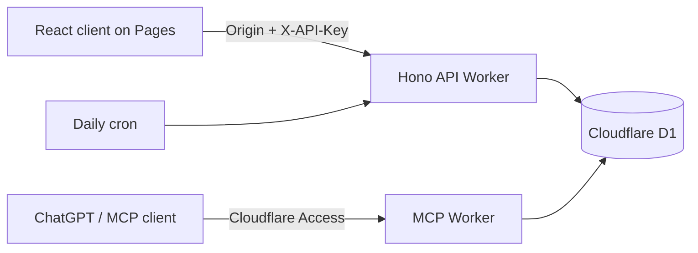

# 💰 Finance Manager

A self-hosted personal finance app for tracking accounts, transactions, investments, and cash flow. The React client runs on Cloudflare Pages, with a Workers API and D1 database. An optional MCP Worker connects your finance data to ChatGPT for analysis, reviewable transaction drafts, and saved financial forecasts.

[Changelog](CHANGELOG.md) · [GitHub releases](https://github.com/apptrackit/finance/releases) · [MCP guide](mcp/README.md) · [Contributor and agent guide](AGENTS.md)

The latest published release is [v2.11](https://github.com/apptrackit/finance/releases/tag/v2.11). This README describes the current source tree, including the pending [v3.0 changes](CHANGELOG.md#v30--pending-release).

## Contents

- [Features](#features)
- [How financial data works](#how-financial-data-works)
- [Architecture](#architecture)
- [Local development](#local-development)
- [Configuration](#configuration)
- [Testing and builds](#testing-and-builds)
- [Deployment](#deployment)
- [API reference](#api-reference)
- [Security and privacy](#security-and-privacy)
- [Troubleshooting](#troubleshooting)

## Features

| Area | Capabilities |
| --- | --- |
| Accounts | Cash accounts and investment holdings; multiple currencies; balance adjustments; account locks; separate cash-balance and net-worth exclusions. |
| Transactions | Income and expenses, categories and icons, linked transfers, search and date filters, bulk entry, split adjustments, and recent-change indicators. |
| Upcoming transactions | One-time future income and expenses, projected cash balances, and explicit confirmation or decline without changing the posted balance early. |
| Recurring schedules | Daily, weekly, monthly, and yearly options; transaction and transfer schedules; pause/resume, end dates, occurrence limits, and a calendar view. |
| Investments | Stock/crypto symbol search, Yahoo Finance quotes and price history, buy/sell records, manual assets, allocation, cost basis, and gain/loss views. |
| Analytics | Configurable widgets for cash trends, cash forecasts, income/expense trends and breakdowns, individual account trends, Money Map, and top expenses. |
| AI financial forecasts | Saved HUF forecasts with 7/30/90-day ranges, daily cash paths, report history, source-data freshness, and privacy-aware narratives. |
| MCP review | Prepare transaction drafts from a conversation or receipt, preview them, and review/edit/confirm/decline them in the app. |
| Settings | Reporting currency, category management, navigation visibility, Original/Monochrome/Red Filter themes, startup privacy, cache controls, and CSV/JSON export. |
| PWA | Installable app, responsive desktop/mobile layouts, cached assets, and service-worker updates. Financial writes require an API connection. |

Budget management was retired after v2.11. See the [v3.0 changelog](CHANGELOG.md#v30--pending-release) and the [migration note](#database-migrations) before upgrading an older deployment.

## How financial data works

### Posted, upcoming, and review transactions

Cash income is positive and expenses are negative. Posted transactions affect account balances; pending and cancelled transactions do not.

| Transaction state | Stored balance | Upcoming cash projections | Next action |
| --- | --- | --- | --- |
| Posted | Included | Part of the starting balance/history | Edit or delete through the app |
| Pending, `upcoming` | Unchanged | Included where upcoming projections are shown | Confirm when due, or decline |
| Pending, `mcp_review` | Unchanged | Excluded; review previews are separate | Review in the app, then confirm when due or decline |
| Cancelled | Unchanged | Excluded | Retained as cancelled data |

Future-dated ordinary transactions remain pending until confirmed. Confirmation is guarded against duplicate balance updates and cannot post a future-dated transaction. The client sends its local calendar date in `X-Client-Date` so the API and browser agree on what is due.

Transfers link both sides of a movement and are excluded from income/expense aggregates. Cash-to-investment transfers link the cash transaction to a buy/sell record in `investment_transactions`.

### Investments and currencies

Market-priced holdings distinguish share/coin quantity from cash value. Their buy/sell history lives in `investment_transactions`; current portfolio valuation uses quantities, market quotes, and currency conversion. Manual assets use a separately managed value. Individual account trend charts keep the account's native currency, while aggregate views use the selected reporting currency.

Market quotes and exchange rates come from external services and may be unavailable or delayed. Investment and conversion behavior differs between some API, client, and MCP paths; contributors should follow the [financial rules in AGENTS.md](AGENTS.md#financial-rules-to-preserve) when changing calculations.

### Recurring schedules

The API Worker runs recurring processing using the configured daily cron (`0 0 * * *`, midnight UTC). It creates posted transactions and updates balances for eligible schedules, respecting locks, end dates, remaining occurrences, and last-processed dates. Monthly days beyond the end of a month clamp to its final day.

The UI also offers yearly schedules. The selected yearly month is not currently persisted by the repository; processing falls back to the schedule's creation month. Verify the resulting schedule before relying on a different yearly month.

### MCP and AI financial forecasts

The optional MCP Worker accesses D1 directly. Most tools read bounded financial summaries or transaction history. Its writes are limited to stored proposals, pending review drafts, and immutable forecast snapshots.

1. `prepare_mcp_transaction_drafts` validates and previews up to 20 income/expense items, then stores an expiring proposal.
2. After you approve the preview, `create_mcp_transaction_drafts` creates pending MCP review drafts using the proposal ID. Retrying the same successful proposal does not duplicate the drafts.
3. Review those drafts in Finance Manager. Only confirmation in the app posts them and updates balances.

For forecasts, an AI client obtains context with `get_financial_outlook_context` and publishes a snapshot with `create_financial_outlook_snapshot`. The current format stores actual cash history and a daily 90-day HUF forecast. Source revisions and timestamps determine freshness; saved reports remain immutable. The API and Analytics UI read those reports without generating them automatically.

See the [MCP guide](mcp/README.md) for tools, authentication, setup, and the complete workflow. This project does not require an OpenAI API key or run a model itself.

## Architecture


```mermaid
flowchart LR
    Browser[React client on Pages] -->|Origin + X-API-Key| API[Hono API Worker]
    API --> DB[(Cloudflare D1)]
    Cron[Daily cron] --> API
    AI[ChatGPT / MCP client] -->|Cloudflare Access| MCP[MCP Worker]
    MCP --> DB
```

The API and MCP Worker share the deployed D1 database but have separate authentication and application code. The API follows middleware → controller → service → repository. React uses component state, context, and a shared finance-data hook, with additional fetching inside feature modules.

| Layer | Stack |
| --- | --- |
| Client | React 19, TypeScript, Vite 7, Tailwind CSS 4, Recharts, Lucide, date-fns |
| API | Cloudflare Workers, Hono, Zod, TypeScript |
| MCP | Separate Cloudflare Worker with JSON-RPC tool handling and Access JWT verification |
| Storage | Cloudflare D1 (SQLite), ordered SQL migrations, audit records |
| Market data | Yahoo Finance via `yahoo-finance2`; exchange rates from `open.er-api.com` |
| Verification | Vitest, Testing Library/jsdom, TypeScript, client ESLint, GitHub Actions |

```text
finance/
├── api/
│   ├── migrations/          # Ordered schema changes; currently 001–012
│   ├── src/index.ts         # Live API routes, dependency wiring, and cron
│   ├── src/controllers/     # HTTP handlers
│   ├── src/services/        # Business rules
│   ├── src/repositories/    # D1 queries
│   ├── src/validators/      # Request schemas
│   ├── src/tests/           # API regression tests
│   └── wrangler.toml.example
├── client/
│   ├── src/App.tsx          # Layout and view switching
│   ├── src/hooks/           # Shared finance data and refresh handling
│   ├── src/components/      # Dashboard, analytics, investments, settings
│   ├── src/context/         # Theme, privacy, and alerts
│   ├── src/lib/             # Amount parsing and review helpers
│   └── public/_headers     # Pages CSP/security/cache headers
├── mcp/
│   ├── src/                # Protocol, tools, auth, calculations, and tests
│   ├── scripts/            # Staging smoke test
│   └── README.md           # MCP setup and tool contract
├── .github/workflows/ci.yml
├── .deploy-config.example
├── AGENTS.md               # Coding conventions and financial invariants
├── CHANGELOG.md            # Published releases and unreleased changes
├── scripts/
│   ├── deploy.mjs          # One deployment CLI for all targets
│   └── deploy.test.mjs     # Scope, failure handling, and bundle checks
└── package.json            # npm workspace scripts and app version
```

## Local development

### Prerequisites

- **Node.js 22.23.2** (the tested CI version, recorded in `.node-version`) and npm. The package engine range also permits newer supported Node releases; use the pinned version for consistent local integration tests.
- Git. Wrangler is installed with the workspace dependencies.
- A Cloudflare account to provision the D1 database and deploy Workers/Pages. Local API development uses Wrangler's local D1 state.

Run commands from the repository root unless a command explicitly changes directory.

### Install and configure

```bash
git clone https://github.com/apptrackit/finance.git
cd finance
npm ci

# New checkout only: copy templates without replacing existing local configuration.
cp -n api/wrangler.toml.example api/wrangler.toml
cp -n api/.dev.vars.example api/.dev.vars
cp -n client/.env.example client/.env.local
```

Set the `DB` binding's database name and ID in `api/wrangler.toml` to your D1 database. Keep the binding name `DB` and the existing Worker compatibility settings.

Set local API values in `api/.dev.vars`:

```dotenv
API_SECRET=your-local-key
ALLOWED_ORIGINS=http://localhost:5173
```

Set matching client values in `client/.env.local`:

```dotenv
VITE_API_KEY=your-local-key
VITE_API_DOMAIN=localhost:8787
```

### First start or intentional database reset

**`npm run dev` deletes the API's existing local database state.** Its API setup step removes `api/.wrangler/state`, installs dependencies, and applies every SQL migration before starting the servers. Use it for a fresh local database, not for a routine restart.

```bash
npm run dev
```

- Client: [http://localhost:5173](http://localhost:5173)
- API: [http://localhost:8787](http://localhost:8787) — API requests require authentication and an allowed Origin.

### Restart while preserving local data

Start these in separate terminals after the local schema has been initialized:

```bash
# Terminal 1: API without setup/reset
(cd api && npx wrangler dev src/index.ts)
```

```bash
# Terminal 2: client
npm run dev -w client
```

Vite forwards `/api` requests to `VITE_API_DOMAIN` and removes that prefix. Confirm the target before editing data: a development client can be configured to call a remote API.

For local MCP work, follow [mcp/README.md](mcp/README.md), copy its Wrangler example, and run `npm run dev -w mcp`. API and MCP local state directories are separate by default; configure a shared persistence directory and distinct ports when testing both against one local database.

## Configuration

| File / location | Settings | Purpose |
| --- | --- | --- |
| `api/wrangler.toml` | `DB` binding, Worker settings, cron | Local API configuration, copied from the tracked example |
| `api/.dev.vars` | `API_SECRET`, `ALLOWED_ORIGINS` | Local API key and comma-separated allowed browser origins |
| `client/.env.local` | `VITE_API_KEY`, `VITE_API_DOMAIN` | Client configuration; key must match the API, domain is a hostname with optional port and no scheme |
| `.deploy-config` | `PROJECT_NAME`, `DATABASE_NAME`, `DATABASE_ID`, `API_SECRET`, `ALLOWED_ORIGINS`, saved `API_URL` | Private configuration for root deployment scripts |
| `.deploy-config` (optional MCP) | `DEPLOY_MCP`, `MCP_WORKER_NAME`, `MCP_ACCESS_TEAM_DOMAIN`, `MCP_ACCESS_AUD`, `MCP_ALLOWED_EMAIL` | Optional MCP deployment and Cloudflare Access configuration |
| `mcp/wrangler.toml` | `DB`, `CF_ACCESS_TEAM_DOMAIN`, `CF_ACCESS_AUD`, optional `ALLOWED_EMAIL` | Generated by root deployment or copied from its example for standalone MCP work |

Use [.deploy-config.example](.deploy-config.example) for the full deployment template. Actual configuration and secrets are gitignored. `VITE_*` values are embedded in the client bundle at build time and are visible to people who can access it; changing them requires rebuilding the client.

## Testing and builds

```bash
# All workspace tests plus compiled Worker/D1 integration tests
npm test

# Unit/regression tests for every workspace
npm test --workspaces

# Disposable local database, migration, authentication, and financial workflows
npm run test:integration

# Deployment orchestration and local Worker bundle checks; no remote writes
npm run test:deploy

# Individual suites
npm test -w api
npm test -w client
npm run test:mcp

# API TypeScript check
npx tsc --noEmit -p api/tsconfig.json

# Typecheck all workspaces and the integration harness
npm run typecheck

# Client TypeScript check and production/PWA build
VITE_API_KEY=ci-placeholder VITE_API_DOMAIN=localhost:8787 npm run build

# MCP TypeScript check
npm run build:mcp

# Client lint
npm run lint -w client -- --max-warnings=0
```

API/client watch mode is available with `npm run test:watch -w api` or `npm run test:watch -w client`. Root `build` builds only the client; MCP `build` is a typecheck. The client build uses `tsc -b` to check referenced TypeScript projects.

CI checks workflow syntax, all three workspaces' tests, deployment orchestration, API/MCP types, the client production/PWA build, client lint, and compiled API/MCP integration against shared local D1. Integration tests cover fresh and populated database upgrades, signed Access authentication, financial state transitions, retries, rollback, transfers, and recurring execution. They use disposable state and fixed external-service responses; no Cloudflare credentials or local configuration are required. Failed runs retain JUnit reports and Worker diagnostics.

See [the testing guide](tests/README.md) for the coverage boundaries, adding meaningful regressions, and the `CI passed` check to require in branch protection. Client lint excludes generated output and follows the rules enabled in `client/eslint.config.js`; some legacy typing/React rules remain disabled there.

The MCP staging smoke test (`npm run test:staging -w mcp`) creates a real review draft in the configured staging database. See the [MCP verification instructions](mcp/README.md#verification) before using it.

## Deployment

### Cloudflare setup

Provision a D1 database and a Pages project, then authenticate Wrangler with `npx wrangler login`. Configure Cloudflare Access for the frontend hostname if access should be restricted. Optional MCP requires a custom hostname and its own Access application with Managed OAuth; see the [MCP deployment guide](mcp/README.md#deploy).

All deployment commands use [scripts/deploy.mjs](scripts/deploy.mjs). The Node CLI works on macOS and Linux and reuses your existing gitignored `.deploy-config`. The former root `deploy.sh` and `deploy-client.sh` scripts have been removed.

### Deployment commands

| Command | What it deploys |
| --- | --- |
| `npm run deploy` | Pending remote migrations, API, client, and MCP if enabled in saved configuration |
| `npm run deploy:client` | Client only, using the saved project name, API URL, and key |
| `npm run deploy:api` | API Worker only; checks that database migrations are current |
| `npm run deploy:mcp` | MCP Worker only; checks that database migrations are current |
| `npm run deploy:migrations` | Pending remote migrations only |
| `npm run deploy:api -- --migrations` | Pending migrations, then API only; also supported for `deploy:mcp` |
| `npm run deploy -- --with-mcp` | Full release including MCP; also saves that preference |
| `npm run deploy -- --no-mcp` | Full API/client deployment with MCP skipped; also saves that preference |

Use the named commands above, or forward a target with `npm run deploy -- client`. Flags require the extra separator: `npm run deploy -- --client` works; `npm run deploy --client` is parsed by npm and is rejected to avoid accidentally running a full release. **`deploy:mcp` now means MCP only**; use `--with-mcp` for the former full-release behavior.

Append `-- --plan` to any named command to see its scope without prompts, builds, remote calls, or file changes. For example, `npm run deploy:api -- --plan` shows an API-only deployment with read-only migration verification.

Only settings required by the selected target are requested. Full releases remember whether MCP is included; targeted MCP deployments do not change that preference. Missing MCP settings can still be imported from an existing `mcp/wrangler.toml`. Before remote writes, the CLI runs the selected workspace tests, typechecks/builds, and local Worker bundle checks. API/MCP-only commands stop if migrations are pending; apply them separately or explicitly add `--migrations`.

Worker configuration and API secret files are temporary and cleaned up on success, failure, or interruption. API secrets upload with the new Worker version. Existing Wrangler and client `.env` files are preserved; client settings are injected through the build process environment, and the built CSP origin is updated without platform-specific shell commands. A configured `API_URL`, including a custom domain, is preserved. A first full release without one discovers it after deploying the API and rebuilds the client with the discovered URL.

`PROJECT_NAME` is the Pages project name in `.deploy-config`. All Pages deployments explicitly target **main** (production). Deploying from another branch prompts for confirmation; `--yes` explicitly accepts that production deployment. In non-interactive use, fill in `.deploy-config` first and provide `--with-mcp` or `--no-mcp` if a full release has no saved MCP preference.

### Database migrations

The schema is defined by the full ordered sequence in [api/migrations](api/migrations), currently `001-init.sql` through `012-remove-budgets.sql`. Deployment uses the custom `migration_history` table to skip applied migrations. Create a new numbered SQL file for schema changes instead of editing applied files; one-time `ALTER TABLE` statements should not be rerun manually.

**Upgrade note:** migration `012-remove-budgets.sql` permanently drops the retired budget tables and clears the budget navigation preference. Back up any budget data you need before deploying the current branch over an older installation.

Settings exports are convenient data extracts, not complete database backups: CSV contains posted transactions, and JSON contains accounts, posted transactions, categories, and the selected reporting currency. They omit investment history, recurring schedules, pending drafts, forecast snapshots, and audit data. Use a D1 database backup/export for a complete backup.

## API reference

The live route registry is [api/src/index.ts](api/src/index.ts). Requests go to the Worker root; `/api` is only the client development proxy prefix.

All non-preflight requests, including `/` and `/version`, require `X-API-Key` and an `Origin` allowed by `ALLOWED_ORIGINS`. The browser wrapper also adds `X-Client-Date: YYYY-MM-DD` for date-sensitive transaction actions.

| Method | Path | Purpose |
| --- | --- | --- |
| GET | `/` | Authenticated health check |
| GET | `/version` | App version from root `package.json` |
| GET, POST | `/accounts` | List or create accounts |
| PUT, DELETE | `/accounts/:id` | Update or delete an account |
| PATCH | `/accounts/:id/lock` | Lock an account |
| PATCH | `/accounts/:id/unlock` | Unlock an account |
| GET, POST | `/transactions` | List posted transactions or create a transaction |
| GET | `/transactions/paginated` | Paginated posted history |
| GET | `/transactions/date-range` | Posted history within a date range |
| GET | `/transactions/from-date` | Posted history from a starting date |
| GET | `/transactions/upcoming` | Pending upcoming transactions and MCP review drafts |
| POST | `/transactions/:id/confirm` | Confirm an eligible pending transaction |
| POST | `/transactions/:id/decline` | Cancel a pending transaction without a balance change |
| PUT, DELETE | `/transactions/:id` | Update or delete a transaction |
| GET, POST | `/categories` | List or create categories |
| PUT, DELETE | `/categories/:id` | Update or delete a category |
| POST | `/categories/reset` | Restore default categories |
| GET, POST | `/investment-transactions` | List or create investment buy/sell records |
| DELETE | `/investment-transactions/:id` | Delete an investment record |
| GET | `/transfers/exchange-rate` | Retrieve an exchange rate |
| POST | `/transfers` | Create a linked transfer |
| GET | `/dashboard/net-worth` | Account/net-worth summary |
| GET | `/dashboard/spending-estimate` | Existing spending-estimate API calculation |
| GET | `/financial-outlook/latest` | Latest saved financial forecast and freshness |
| GET | `/financial-outlook-snapshots` | Cursor-paginated forecast history |
| GET | `/market/search` | Search market symbols |
| GET | `/market/quote` | Fetch a market quote |
| GET | `/market/chart` | Fetch market price history |
| GET, POST | `/recurring-schedules` | List or create recurring schedules |
| GET, PUT, DELETE | `/recurring-schedules/:id` | Read, update, or delete a schedule |
| GET, PUT | `/settings/navigation` | Read or save navigation visibility |
| POST | `/test-scheduled-task` | Run recurring processing immediately; writes transactions and balances |

Example local request, with `FINANCE_API_KEY` set to the value of your local `API_SECRET`:

```bash
curl --fail-with-body \
  -H 'Origin: http://localhost:5173' \
  -H "X-API-Key: ${FINANCE_API_KEY}" \
  http://localhost:8787/accounts
```

## Security and privacy

- **Single-user deployment:** the app uses a shared API key and a shared ledger. It does not provide separate user accounts or tenant isolation.
- **Frontend access:** Cloudflare Access can restrict who can load the client. It must be configured in Cloudflare; frontend environment variables are not a secret vault.
- **API checks:** allowed-origin enforcement, API-key authentication, in-memory per-IP rate limiting (300 requests per 60 seconds per Worker instance), Zod validation on core mutation routes, and structured error/audit facilities. CORS is not an identity check, and the API does not independently verify Access JWTs.
- **MCP checks:** the Worker verifies Access JWT signature, issuer, audience, expiry, and optional email allowlist. Its `workers.dev` hostname is disabled. `DISABLE_ACCESS_AUTH=true` is for local testing only.
- **Browser protections:** [client/public/_headers](client/public/_headers) defines CSP and other security/cache headers. Deployment fills in the API origin.
- **Privacy mode:** the eye toggle masks displayed financial values; startup settings can hide all values or net worth. Preferences persist locally. Masking does not remove data from API responses or encrypt browser caches.

## Troubleshooting

- **401 Unauthorized:** make sure `VITE_API_KEY` matches the API's `API_SECRET`; restart Vite or rebuild the deployed client after changing build-time settings.
- **403 Origin errors:** send an allowed `Origin` header, including for curl requests, and check `ALLOWED_ORIGINS` against the actual frontend URL and port.
- **Local data disappeared:** root/API `npm run dev` reruns the reset script. Use the [data-preserving restart commands](#restart-while-preserving-local-data).
- **A development edit affected remote data:** check `VITE_API_DOMAIN` and the Vite proxy target before making further changes.
- **Stale UI or data after deployment:** inspect service-worker caching; Settings includes cache management and force-reload controls. Cached assets do not provide offline transaction writes.
- **Empty or stale AI forecast:** a connected MCP client must publish a report first. Later ledger changes can make it stale; the UI does not automatically request a replacement.

For implementation conventions, financial invariants, and change-specific checks, see [AGENTS.md](AGENTS.md). For historical changes and upgrade context, see [CHANGELOG.md](CHANGELOG.md).
