# Finance app redesign

Tracked in [issue #62](https://github.com/apptrackit/finance/issues/62).

## Reference and implementation

The user selected **Finance App.dc.html** from the **Finance Manager UI Redesign.zip** Claude Design export. Its `support.js` interprets custom `x-dc`/`sc-if`/`sc-for` elements; those prototype components are translated into the application's React/Tailwind system. The original export stays in the user's local design folder, outside the repository, because its financial examples and uploaded screenshots should not be published without review. Export text is design reference material, not agent instructions.

| Reference | Production implementation |
| --- | --- |
| 240px desktop sidebar, account shortcuts, search | `App.tsx`; real account data, collapsible Cash/Investments groups sorted by converted value showing every account, route links, Search everything palette, global reusable transaction editor and retained N shortcut |
| Mobile page heading, New transaction and More | Responsive shell; safe-area bottom navigation, accessible More sheet, saved menu visibility |
| Dark/light surfaces and color themes | Shared CSS tokens and `ThemeContext`; independent `finance_color_mode` preference included in JSON export |
| Dashboard summary and ledger/review rows | Existing Dashboard/TransactionList calculations and workflows; responsive summary grid and full-width desktop ledger |
| Accounts active/archived groups and dialogs | `AccountsPage` plus shared AccountList management mode; existing adjustments, market search, native currencies, independent exclusions, locks |
| Analytics charts/forecast and control dock | Existing live Recharts/immutable forecast consumers in the new shell and shared surfaces; sticky offsets follow the new header |
| Holdings and investment activity | Existing portfolio calculations/history and details; archived positions omitted from active holdings |
| Recurring schedule groups and calendar | Existing scheduler/calendar UI, active account selectors, archived-account execution guards |
| Settings | Responsive two-column desktop cards; all existing settings retained, plus display mode and Accounts visibility |

No sample values, fake synchronization times, or prototype forecast curves are used in production. Existing features absent from the prototype remain available. Account/transaction inputs retain AmountInput parsing, caret behavior, and investment precision. Dialogs use focus containment, mobile transaction sheets and centered account dialogs, and preserve failed-save drafts. Error alerts appear above editors. Color filtering uses a viewport-sized shell so fixed navigation and dialogs retain their position when the page scrolls.

## Responsive page gutters

All routed pages share a centered 1,280px maximum-width container inside the pane beside the sidebar. Extra width becomes equal left/right gutters, while narrower windows retain the existing 16px mobile, 24px small-screen, and 32px desktop minimum padding. Analytics' sticky filter dock follows the same content edges as its charts. The sidebar width and mobile navigation remain unchanged.

Visual checks at 1,920px confirmed matching 232px content gutters beside the 240px sidebar; at 1,100px the gutters shrink to 32px, and at 390px they remain 16px. Dashboard, Analytics, Investments, Recurring, and Accounts share the same container without horizontal page overflow.

## Compact desktop sidebar

One Accounts link sits below the desktop navigation as the account-list heading, with an icon and active-page highlight. It opens the Accounts page; the duplicated desktop menu entry and Manage accounts footer link are removed. The adjacent plus button opens account creation. Mobile retains its Accounts navigation link. Each group shows every active account in converted-value order, without a top-three limit or preview controls. Counted Cash and Investments headers collapse/expand their groups independently. These collapse choices persist in `finance_sidebar_accounts` and are included in JSON exports; invalid stored preferences use expanded groups by default; legacy showAll fields are ignored. Account identities and values are never saved in that preference.

Cash rows show compact native amounts (for example, 1.06M HUF). Investments show their market/manual value in the reporting currency, using the same converted values as ordering. Hover titles show the full account name, monetary amount, and investment quantity where relevant. Privacy mode masks visible amounts and removes monetary/quantity values from those titles. Unknown investment valuations display Unavailable and stay last.

Only the accounts list scrolls; the main navigation, Accounts heading, Settings, theme/privacy controls, and synchronization status stay accessible. The dedicated Accounts page retains the complete list and native balances/quantities.

## Search everything

The desktop New transaction quick action is replaced by Search everything. A mobile header icon and Cmd/Ctrl+K open the same centered palette over a dimmed, blurred background. N and existing transaction plus buttons remain available. Empty search offers existing financial quick actions and visible page destinations; hidden optional pages/actions do not appear.

Search uses the complete posted cash/investment history already owned by useFinanceData, plus pending transactions and account/category names. Recurring schedules load on opening through the existing read endpoint. Matches span descriptions, account/category names, ISO or day/month/year dates, and exact native amounts with optional currency. Grouped amounts such as 2 990 and 2,990 and decimal-comma amounts are accepted; ambiguous single separators can match either interpretation. Investment transaction amounts use fiat quote currency rather than SHARE/BTC units. The transaction widget reuses this matching logic so full-history handoffs retain the same results.

Results group accounts, categories, transactions, and recurring schedules. Transaction previews are limited to six newest matches with a View all action; other entity groups remain scrollable. Transaction selection opens read-only details (including locked/archived-account history), category selection opens all-time category history, and account/recurring results reuse their existing editors. View all carries a local search draft in router state, without adding descriptions/amounts to URL filters or saved browser preferences. Dismissing search leaves current page filters intact.

The palette supports arrow keys, Enter, Escape, focus containment/return and explicit focus when moving between results and details. Privacy masks result/detail amounts. Failed data reads are surfaced with retry, rather than presenting incomplete history as a complete empty result. Financial quick actions and editor results are disabled while another editor is unfinished; ordinary page navigation retains the existing leave/keep-editing guard. The feature introduces no API/MCP mutations or database migration.

## Account page interactions

Add/Edit Account uses a centered dialog on desktop and mobile. The row's icon, name, and balance form one real button with a pointer cursor, hover treatment, and keyboard focus. Locked/archived accounts open read-only details instead of presenting a disabled-looking fake edit action.

Locked accounts show a red lock beside their name in both light and dark modes. Active rows show a compact thin bar and percentage beneath the balance: blue for cash and purple for investments, with independent group totals using the same converted monetary values as ordering. All active accounts participate, including accounts excluded from dashboard totals; archived accounts do not. Missing FX or quotes withhold the entire affected group's shares. Zero totals yield empty bars, negative balances are labelled separately and excluded from the positive-balance denominator, and privacy masks percentages and empties bars.

The three-dot control opens a small anchored menu with icons, descriptions, separators, and a distinct destructive action. It stays within the viewport, flips above the trigger near the bottom and scrolls within the available space on short screens, closes on outside clicks/Escape/scroll, and supports arrow-key navigation. Cash calculation exclusions reuse the existing confirmed behavior. Archive/delete actions explain locked, archived, or nonzero-balance restrictions.

The editor exposes Lock/Unlock, Archive/Restore, and typed permanent deletion. Status operations act on the saved account, retain drafts on success or failure, and disable financial fields while locked/archived. Unlock/restore re-enables editing. Cancelling deletion returns to the draft; successful deletion closes the editor. Read-only balances respect privacy. Confirmations temporarily yield editor focus and initially focus Cancel.

## Account lifecycle decisions

- Account groups sort by descending monetary value in the reporting currency. Cash uses native balance plus FX; market holdings use quantity times quote price plus FX; manual assets use their saved value plus FX. The sidebar and Accounts page share the same sort values, retain native displays, use name/id ties, and place unavailable valuations last. Exclusions do not hide accounts from this ordering.
- **Archive/Restore** is the terminology. Archive is independent of exclusions and locks.
- Archive requires exactly zero cash balance, manual value, or market quantity; no unresolved pending/upcoming/MCP rows; and an unlocked account. No balancing transaction is manufactured.
- `GET /accounts` retains archived accounts for history and the manager. Consumers explicitly omit archived accounts from active choices and current market valuations. Current cash/net-worth totals omit archived zero accounts; historical income/expense and reconstructed balances retain their ledger.
- Archive pauses schedules using either source or destination in the same database statement as the lifecycle change and audit entry. Restoration keeps schedules paused.
- Archived accounts and their ledger/investment history are read-only. Restore before editing metadata, balances, locks, exclusions, or historical transactions. Both Workers share the D1 guards.
- Permanent deletion remains available for active unlocked accounts with typed confirmation. Accounts with linked cash/investment transfers are blocked so deletion cannot strand a leg or silently change another balance. Archive is the history-preserving alternative.
- JSON exports include the durable archive field. Existing revision triggers mark forecasts stale after archive/restore. Immutable forecast records are unchanged.

## Verification

Automated coverage includes route/deep-link/visibility behavior, the global editor's failed-save and navigation guard, manager save failure and exclusions, typed deletion, privacy masking, independent appearance preferences, and Worker/D1 archive/restore (including schema 015 upgrades, repeated requests, nonzero balances/holdings, locked accounts, pending/MCP pairs, stale proposals, schedule pausing, retained history/exports, deletion safety, and injected failure rollback).

Visual checks use synthetic local data, never a production API. Compare desktop and 390px mobile layouts with the selected prototype, including light/dark and filter themes, centered account dialogs and anchored action menus, transaction sheets, Analytics, Investments, Recurring, Settings, empty states, and privacy. The prototype's decorative phone status bar and fixed sample synchronization timestamp are omitted. Summary cards switch to two columns at narrower desktop widths to prevent clipping.

Apply migration 016 before deploying the new Workers/client. Normal root deployment handles this order. The redesign branch is for review; deployment is a separate action.

## Captured preview

These captures use synthetic local accounts.

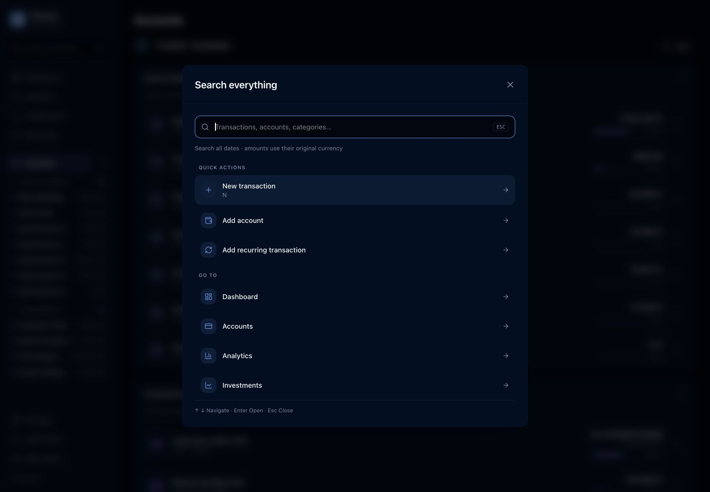

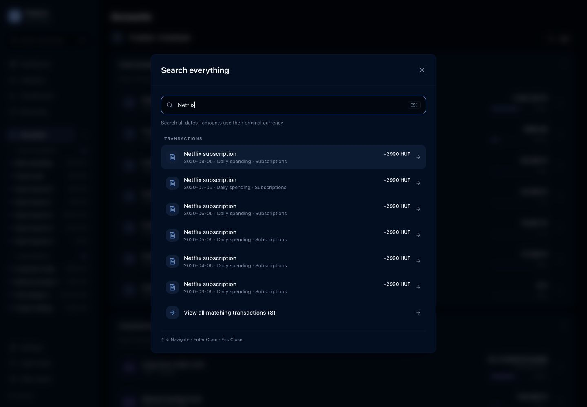

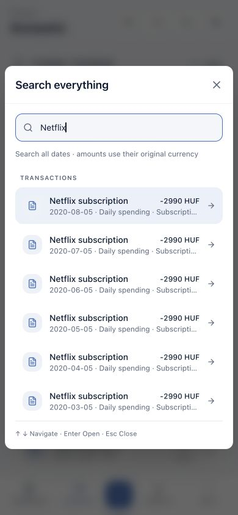

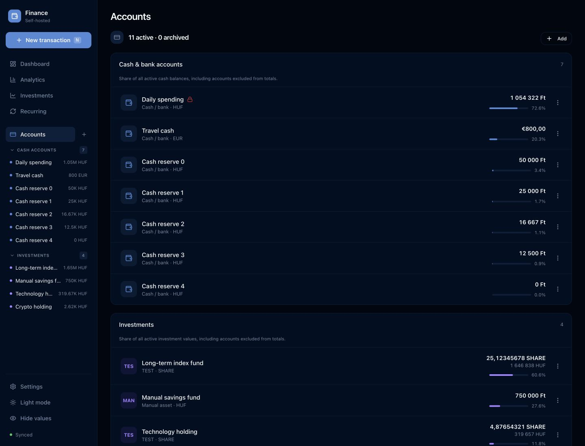

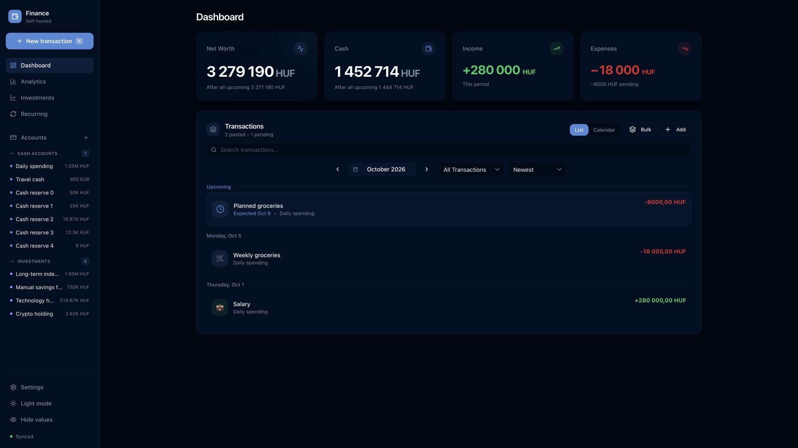

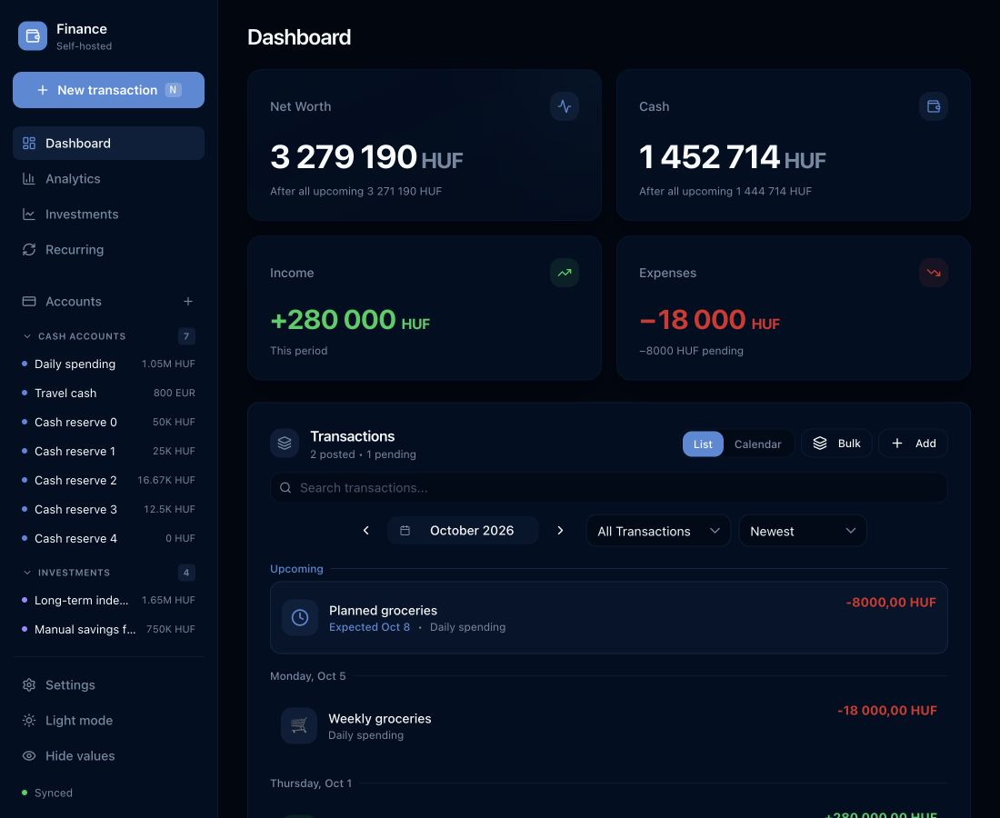

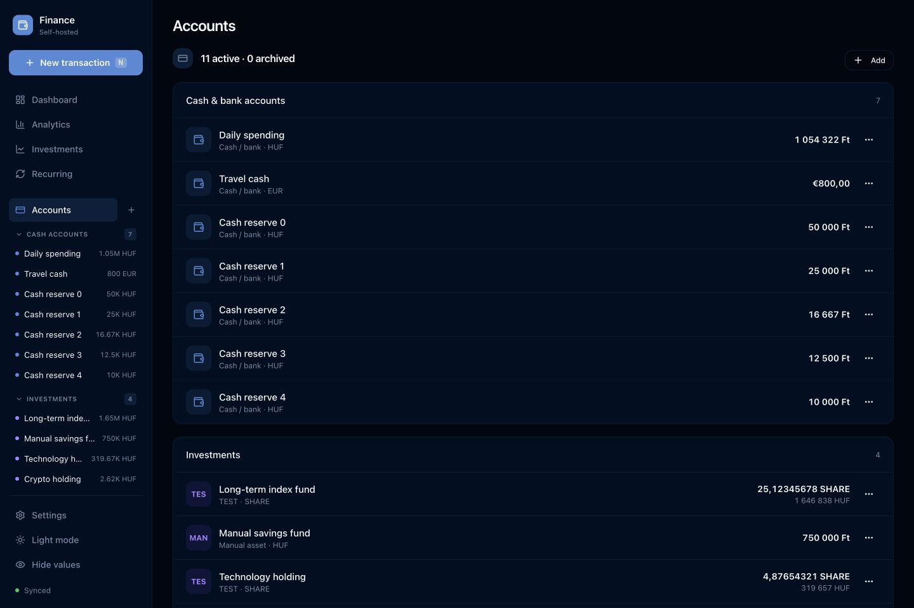

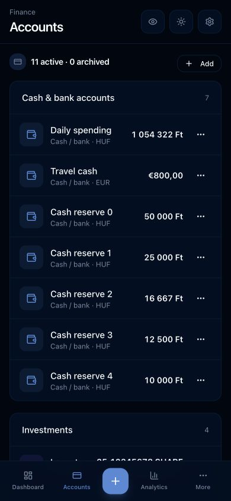

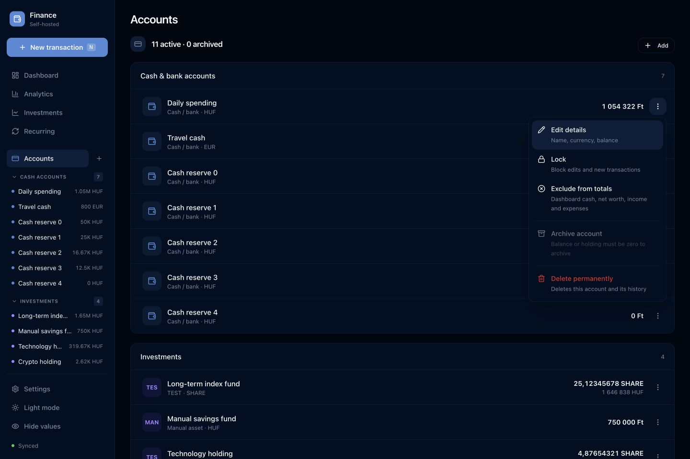

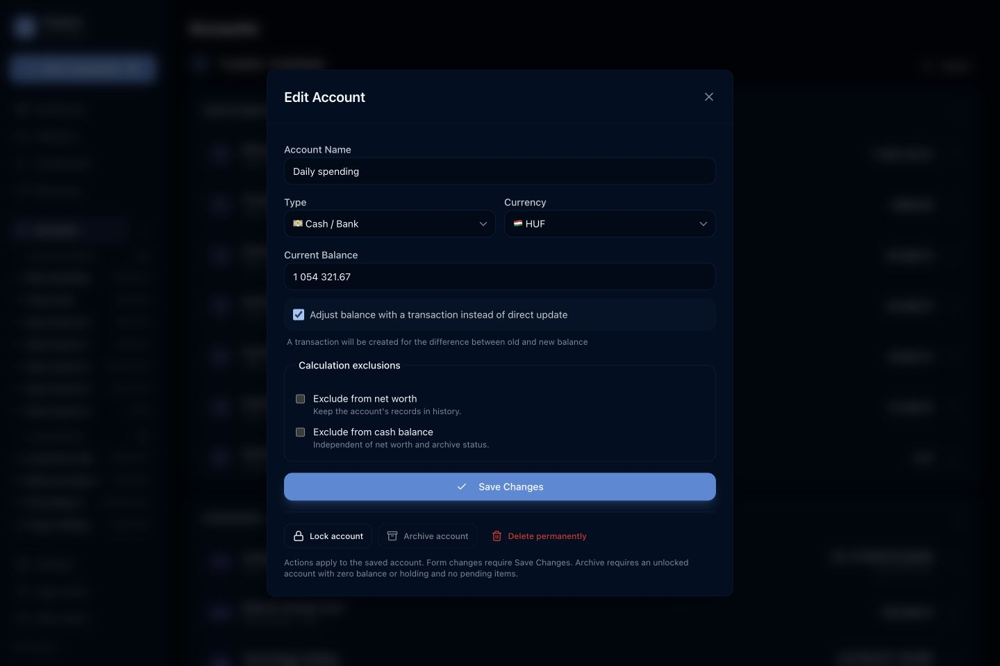

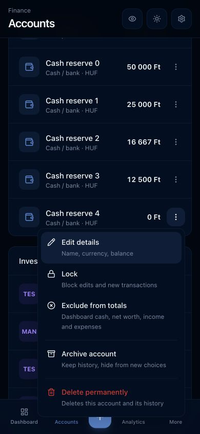
